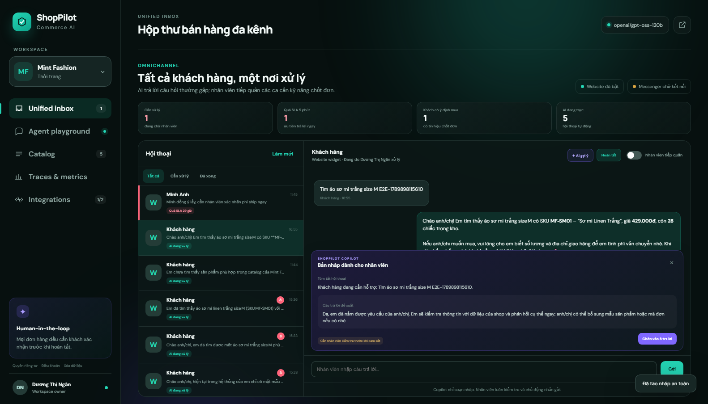
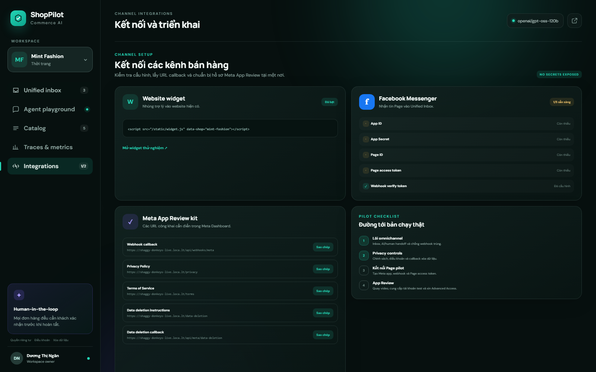
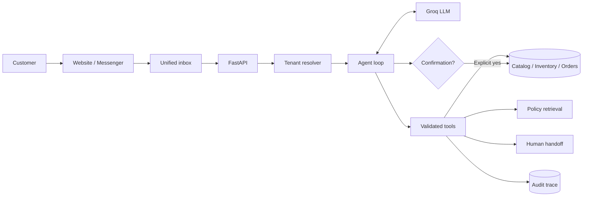

# ShopPilot AI

**Auditable multi-tenant sales and support agent for online shops.**

ShopPilot goes beyond an FAQ chatbot: it uses tools to search a tenant-scoped catalog, check live inventory, retrieve store policies, calculate shipping, prepare draft orders and hand complex conversations to a human. Order confirmation is enforced by deterministic application code, so the LLM cannot complete a write action on its own.

> Portfolio project by **Dương Thị Ngân** · Student ID **2A202602808**



## What makes it different

- **Multi-tenant SaaS foundation:** one agent engine, isolated catalog, policies and conversations per shop.
- **Real tool loop:** Groq chooses tools; Python validates and executes them; observations return to the model.
- **Grounded answers:** prices, stock and policy evidence come from business data instead of model memory.
- **Safe write workflow:** draft order → explicit customer confirmation → final inventory check → stock update.
- **Human handoff:** escalates complaints, exceptions and low-confidence cases with conversation context.
- **Unified inbox:** Website and Messenger conversations share one queue, with an AI/human takeover switch.
- **Revenue-rescue queue:** detects buying signals, flags unanswered handoffs, tracks a five-minute SLA and lets staff take or resolve each conversation.
- **Human reply copilot:** summarizes the thread and drafts a grounded reply for staff review; it never sends a customer message automatically.
- **Meta review readiness:** public privacy/terms pages plus a signed user-data deletion callback and status receipt.
- **Embeddable web widget:** add a sales assistant to an existing store with one script tag.
- **Auditable traces:** records every tool, arguments, result, latency and outcome.
- **Resilient fallback:** core flows continue when the LLM provider is unavailable.
- **Evaluation-first:** automated tests plus a separate scenario suite for routing and safety behavior.



## Demo workspaces

| Shop | Vertical | Domain-specific attributes |
|---|---|---|
| Mint Fashion | Fashion | Size, color, material, fit |
| Lumi Beauty | Cosmetics | Skin type, ingredients, volume |
| Nova Tech | Electronics | Connectivity, power, warranty |

The same agent engine serves all three workspaces without mixing their data.

## Architecture



Detailed design: [docs/ARCHITECTURE.md](docs/ARCHITECTURE.md)

## Tech stack

- Python 3.13, FastAPI and Pydantic
- Groq OpenAI-compatible Chat Completions API
- SQLite for the portfolio MVP
- Responsive HTML/CSS/JavaScript console
- Pytest, scenario evaluation and GitHub Actions
- Docker and Docker Compose

## Run locally

```powershell
Copy-Item .env.example .env
# Add GROQ_API_KEY to .env
./run.ps1
```

Open:

- App: <http://127.0.0.1:8000>
- OpenAPI: <http://127.0.0.1:8000/docs>

The application still works in deterministic fallback mode if `GROQ_API_KEY` is absent.

### Manual setup

```powershell
py -3.13 -m venv .venv313
.\.venv313\Scripts\python.exe -m pip install -r requirements.txt
.\.venv313\Scripts\python.exe -m uvicorn app.main:app --reload
```

### Docker

```bash
docker compose up --build
```

## Test and evaluate

```powershell
.\.venv313\Scripts\python.exe -m pytest -q
.\.venv313\Scripts\python.exe scripts\evaluate.py
.\.venv313\Scripts\python.exe scripts\evaluate.py --online
node scripts\e2e_browser.mjs  # requires the app running on port 8000
```

Current deterministic baseline:

- **21 automated tests passed**
- **10/10 browser E2E checks passed** across AI reply, priority inbox, human copilot, takeover, resolution workflow and integration readiness.
- **16/16 evaluation scenarios passed**
- **16/16 Groq online scenarios passed** after introducing hybrid routing
- Coverage includes tenant isolation, product grounding, stock guard, explicit confirmation, prompt injection refusal and human handoff.

The 100% scenario result describes only the committed evaluation set; it is not a claim of production accuracy.

## Core API

| Method | Endpoint | Purpose |
|---|---|---|
| `GET` | `/api/shops` | List tenant workspaces |
| `GET` | `/api/shops/{slug}/products` | Read tenant-scoped catalog |
| `POST` | `/api/shops/{slug}/chat` | Run the sales agent |
| `POST` | `/api/channels/web/{slug}/messages` | Receive a website-widget message |
| `GET/POST` | `/api/webhooks/meta` | Verify and receive Messenger webhooks |
| `GET` | `/api/shops/{slug}/inbox/conversations` | List unified inbox conversations |
| `GET` | `/api/shops/{slug}/inbox/conversations/{id}/messages` | Read a channel thread |
| `POST` | `/api/shops/{slug}/inbox/conversations/{id}/messages` | Reply as a human agent |
| `POST` | `/api/shops/{slug}/inbox/conversations/{id}/bot` | Switch between AI and human handling |
| `POST` | `/api/shops/{slug}/inbox/conversations/{id}/actions` | Take over, resolve or reopen an inbox conversation |
| `POST` | `/api/shops/{slug}/inbox/conversations/{id}/read` | Mark inbound messages as read |
| `POST` | `/api/shops/{slug}/inbox/conversations/{id}/assist` | Draft a grounded reply for human review without sending it |
| `GET` | `/api/integrations/meta/status` | Read review URLs and configuration readiness without exposing secrets |
| `POST` | `/api/meta/data-deletion` | Verify Meta's signed deletion request and remove user data |
| `GET` | `/api/data-deletion/status/{code}` | Check an anonymous deletion receipt |
| `POST` | `/api/shops/{slug}/products/import` | Import catalog CSV |
| `GET` | `/api/conversations/{id}/trace` | Inspect messages, tools and actions |
| `GET` | `/api/shops/{slug}/metrics` | Read operational demo metrics |

## Repository map

```text
app/
├── agent.py          # Groq tool loop, state and fallback
├── copilot.py        # Human-assist summaries and reply drafts
├── inbox.py          # Idempotent channel-to-agent orchestration
├── channels/         # Website and Meta Messenger adapters
├── tools.py          # Business tools and confirmation workflow
├── repository.py     # Tenant-scoped data access
├── database.py       # SQLite schema and transactions
├── main.py           # FastAPI endpoints
└── static/           # Chat, catalog and observability UI
evals/                # Scenario-based agent evaluation
scripts/evaluate.py   # Reproducible evaluation runner
tests/                # Unit and integration tests
docs/                 # Architecture and interview learning material
```

## Safety boundaries

- The LLM never receives a final-order confirmation tool.
- Draft creation does not decrement stock.
- Product access is scoped by shop before tool execution.
- Prompt injection attempts cannot change prices or expose another tenant.
- The agent escalates complaints and exceptions instead of inventing an answer.

## Current limitations

This repository is a portfolio MVP. Catalog, shipping rules and order fulfillment are simulated. The Meta adapter currently connects one pilot Page through environment variables. A production version would add OAuth onboarding for many shops, PostgreSQL, authentication and RBAC, encrypted customer data, rate limiting, a durable job queue, real commerce/transport adapters, online evaluation with human labels and production monitoring.

## Embed the website widget

```html
<script
  src="https://YOUR-SHOPPILOT-DOMAIN/static/widget.js"
  data-shop="mint-fashion"
  data-color="#18b99f">
</script>
```

For a local preview, open <http://127.0.0.1:8000/static/widget.html?shop=mint-fashion>.

Messenger setup: [docs/META_SETUP.md](docs/META_SETUP.md).

Public review pages are available at `/privacy`, `/terms` and `/data-deletion`.

## Learn the project

- [Learning guide](docs/LEARNING_GUIDE.md): concepts and suggested code-reading order.
- [Interview guide](docs/INTERVIEW_GUIDE.md): 90-second pitch, technical questions and honest limitations.

## License

MIT © 2026 Dương Thị Ngân
