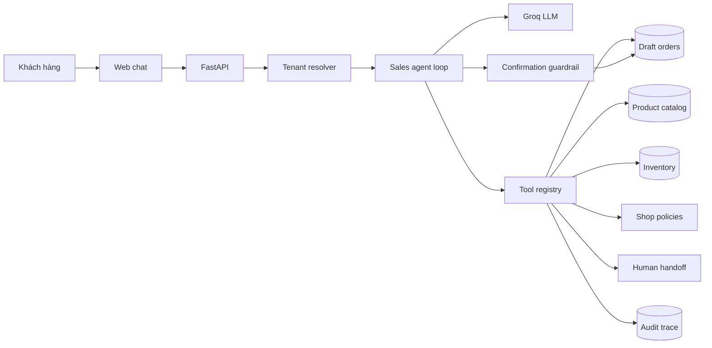

# Kiến trúc ShopPilot AI

## Luồng tổng thể

## Ranh giới trách nhiệm

| Thành phần | Trách nhiệm |
|---|---|
| `agent.py` | Quản lý vòng lặp model → tool → observation → trả lời |
| `tools.py` | Thực thi nghiệp vụ có kiểm soát và ghi trace |
| `repository.py` | Đọc/ghi dữ liệu, luôn giới hạn theo `shop_id` |
| `database.py` | Schema SQLite, transaction và foreign key |
| `main.py` | HTTP API, validation và phục vụ giao diện |
| `static/` | Console chat, catalog, metrics và live trace |

## Multi-tenant

Một bản triển khai phục vụ nhiều shop. Mỗi `conversation`, `product` và `order` đều gắn với một `shop_id`. API nhận `slug`, giải ra shop trước rồi mới tạo tool context. Tool chỉ truy vấn catalog của shop trong context, nên Mint Fashion không thể tìm thấy sản phẩm Nova Tech.

## Agent loop

1. Hybrid router bắt các ý định cần tính xác định: xác nhận/hủy đơn, vận chuyển, ý định mua rõ ràng, chuyển người và prompt injection.
2. Các yêu cầu mở nhận lịch sử hội thoại và system prompt của shop.
3. Model quyết định trả lời hay yêu cầu gọi tool.
4. Tool registry kiểm tra tên tool, tham số và tenant.
5. Tool thực thi, lưu arguments, result, latency và success.
6. Observation được trả lại cho model.
7. Lặp tối đa năm vòng rồi trả lời người dùng.
8. Nếu Groq lỗi, deterministic fallback vẫn xử lý các luồng cốt lõi.

## Write-action guardrail

`prepare_draft_order` chỉ tạo trạng thái `awaiting_confirmation`. Tồn kho chưa bị thay đổi. Chỉ khi tin nhắn tiếp theo chứa xác nhận rõ ràng, workflow xác định mới gọi `confirm_pending_order`, kiểm tra tồn kho lần cuối rồi mới trừ hàng.

Model không có tool `confirm_order`, do đó model không thể tự hoàn tất đơn hàng.

## Quan sát và đánh giá

Mỗi tool call lưu:

- Conversation ID.
- Tool name.
- Arguments.
- Result.
- Thời gian xử lý.
- Trạng thái thành công/thất bại.

`scripts/evaluate.py` chạy bộ scenario độc lập với unit test. Unit test xác nhận code hoạt động; evaluation xác nhận agent chọn đúng tool, đúng tenant, đúng sản phẩm và đúng trạng thái nghiệp vụ.
