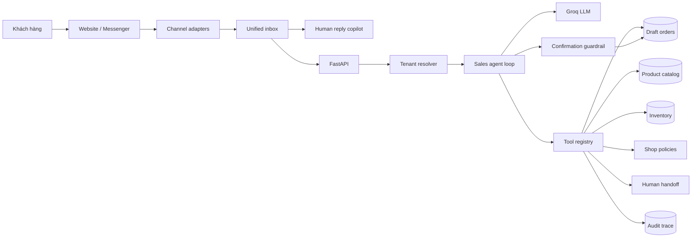

# Kiến trúc ShopPilot AI

## Luồng tổng thể

```mermaid
flowchart LR
    U[Khách hàng] --> C[Website / Messenger]
    C --> AD[Channel adapters]
    AD --> IB[Unified inbox]
    IB --> CP[Human reply copilot]
    IB --> API[FastAPI]
    API --> TR[Tenant resolver]
    TR --> AG[Sales agent loop]
    AG --> LLM[Groq LLM]
    AG --> GD[Confirmation guardrail]
    AG --> TL[Tool registry]
    TL --> P[(Product catalog)]
    TL --> I[(Inventory)]
    TL --> O[(Draft orders)]
    TL --> K[Shop policies]
    TL --> H[Human handoff]
    TL --> T[(Audit trace)]
    GD --> O
```

## Ranh giới trách nhiệm

| Thành phần | Trách nhiệm |
|---|---|
| `agent.py` | Quản lý vòng lặp model → tool → observation → trả lời |
| `tools.py` | Thực thi nghiệp vụ có kiểm soát và ghi trace |
| `repository.py` | Đọc/ghi dữ liệu, luôn giới hạn theo `shop_id` |
| `database.py` | Schema và transaction dùng SQLite local hoặc PostgreSQL trên server |
| `auth.py` | Băm mật khẩu scrypt, tạo phiên đăng nhập HttpOnly và xác thực request |
| `rate_limit.py` | Giới hạn tần suất đăng nhập và chat công khai bằng quota dùng chung trong database |
| `meta_oauth.py` | OAuth state, trao đổi authorization code, chọn Page và đăng ký webhook |
| `main.py` | HTTP API, validation và phục vụ giao diện |
| `channels/` | Chuẩn hóa webhook từng nền tảng và gửi phản hồi |
| `inbox.py` | Chống sự kiện trùng, lưu hội thoại, điều phối AI/người thật |
| `copilot.py` | Tóm tắt hội thoại và soạn nháp có căn cứ để nhân viên duyệt |
| `static/` | Console chat, catalog, metrics và live trace |

## Luồng omnichannel

1. Adapter xác thực webhook của nền tảng và chuyển dữ liệu về `InboundMessage` chung.
2. `channel_events` dùng ID từ nền tảng để không trả lời hai lần khi webhook được gửi lại.
3. `channel_conversations` ánh xạ hội thoại bên ngoài vào hội thoại nội bộ của agent.
4. Khi `bot_enabled=true`, agent xử lý rồi adapter gửi kết quả về đúng kênh.
5. Khi nhân viên tắt AI, tin mới vẫn được lưu nhưng không tự trả lời; toàn bộ ngữ cảnh được giữ để nhân viên tiếp quản.
6. Repository tính trạng thái cần chú ý từ handoff, hướng tin nhắn cuối, tín hiệu mua hàng và thời gian chờ. Ca chờ quá năm phút được đánh dấu vi phạm SLA.
7. Nhân viên có thể nhận xử lý, trả lời, hoàn tất hoặc mở lại hội thoại. Tin nhắn mới tự mở lại hội thoại đã hoàn tất.
8. Website trả lời trực tiếp qua HTTP. Messenger được ghi vào bảng `jobs` trước khi webhook trả `200`, sau đó worker xử lý có retry nên không mất sự kiện khi tiến trình restart.

Priority là quy tắc minh bạch trong Python, không phải điểm số bí mật từ LLM. Vì vậy đội vận hành có thể giải thích tại sao một khách được đưa lên đầu hàng chờ và thay đổi ngưỡng SLA theo nhu cầu.

## Human reply copilot

Copilot đọc tối đa 16 tin nhắn gần nhất cùng catalog và chính sách của đúng shop. Groq trả về structured output gồm `summary`, `suggested_reply` và `risk_flags`; nếu API lỗi, một fallback xác định vẫn tạo bản nháp an toàn. Kết quả chỉ xuất hiện trong console nội bộ và không đi qua channel adapter.

Nhân viên phải bấm **Chèn vào ô trả lời**, có thể sửa nội dung rồi mới bấm **Gửi**. Mỗi bản nháp được lưu với trạng thái `generated` hoặc `used` để sau này đo tỷ lệ chấp nhận. Cơ chế này giữ con người ở điểm quyết định cuối cùng và tránh để AI tự gửi lời hứa về giá, phí giao hoặc hoàn tiền.

Worker claim job bằng cập nhật có điều kiện, retry theo exponential backoff và chuyển sang trạng thái `failed` khi hết số lần thử. Payload và trạng thái nằm trong PostgreSQL; nhiều instance không xử lý cùng một job. Queue depth xuất hiện trong health và Prometheus metrics.

## Tài khoản và phân quyền

1. Chủ shop tạo tài khoản ShopPilot; mật khẩu được băm bằng scrypt với salt riêng.
2. Trình duyệt chỉ giữ session token trong cookie `HttpOnly`, `SameSite=Lax`; cơ sở dữ liệu chỉ lưu SHA-256 của token.
3. `shop_members` gắn người dùng với shop bằng vai trò `owner`, `manager` hoặc `agent`.
4. Khi `AUTH_REQUIRED=true`, inbox, metrics, catalog write và trace đều kiểm tra membership của đúng shop.
5. Khách mua hàng vẫn dùng widget hoặc Messenger mà không cần tài khoản ShopPilot.

Email xác minh và đặt lại mật khẩu dùng token ngẫu nhiên một lần; database chỉ lưu SHA-256 của token. Token có hạn dùng, bị đánh dấu đã sử dụng atomically và mọi phiên đăng nhập cũ bị thu hồi sau khi đổi mật khẩu. Email tồn tại hay không không được lộ qua endpoint yêu cầu reset.

Owner có thể mời thành viên bằng liên kết ngẫu nhiên hết hạn sau bảy ngày. Database chỉ lưu hash của token, tài khoản chấp nhận phải trùng email được mời, và hệ thống không cho xóa hoặc hạ quyền owner cuối cùng. Manager và Agent đọc team nhưng chỉ Owner nhìn thấy, tạo hoặc thu hồi lời mời và thay đổi vai trò.

## Vận hành đơn hàng

Sau khi khách xác nhận, đơn xuất hiện trong backoffice với trạng thái `processing`. Thành viên của đúng tenant có thể chuyển sang `shipped` hoặc `delivered`, lưu mã vận đơn và ghi chú. API luôn kiểm tra membership; một thành viên không thể đọc hay cập nhật đơn của shop khác.

## Subscription billing

Mỗi shop có một subscription độc lập. Owner khởi tạo Stripe Checkout hoặc Customer Portal; secret và price ID chỉ nằm trong deployment secret store. Stripe gọi `/api/webhooks/stripe`, hệ thống kiểm tra HMAC, timestamp chống replay rồi mới upsert customer, subscription, plan và kỳ gia hạn. Khi Stripe chưa được cấu hình, workspace tiếp tục chạy gói Free và giao diện không cho tạo giao dịch giả.

## Chống lạm dụng

Các route đăng ký/đăng nhập dùng chung một quota theo địa chỉ client; API chat và widget dùng quota riêng. Bộ đếm cửa sổ thời gian nằm trong PostgreSQL nên nhiều web instance vẫn áp dụng cùng một quota. Khi vượt ngưỡng, API trả `429 Too Many Requests` cùng header `Retry-After`, giúp client biết thời điểm thử lại.

Giới hạn có thể cấu hình bằng `AUTH_RATE_LIMIT_*` và `CHAT_RATE_LIMIT_*`. Identity được băm SHA-256 trước khi lưu; các bucket hết hạn được dọn trong lúc xử lý request.

## Meta OAuth onboarding

1. Owner bấm **Kết nối Facebook Page** trong ShopPilot.
2. Trình duyệt chuyển tới domain của Meta; mật khẩu Facebook chỉ được nhập tại Meta.
3. Callback kiểm tra OAuth state có thời hạn 15 phút rồi đổi authorization code lấy danh sách Page mà người dùng quản lý.
4. Owner chọn Page. ShopPilot đăng ký webhook và lưu Page access token đã mã hóa bằng Fernet.
5. Khi webhook tới, Page ID được ánh xạ về đúng `shop_id`; adapter giải mã token của đúng connection để trả lời.
6. OAuth state chỉ dùng một lần, token không xuất hiện trong API trả về giao diện hoặc log ứng dụng.

## Xóa dữ liệu Meta

1. Meta gửi `signed_request` tới `/api/meta/data-deletion` khi người dùng yêu cầu xóa.
2. Adapter giải mã Base64URL và kiểm tra HMAC-SHA256 bằng App Secret trước khi tin payload.
3. Repository xóa hội thoại kênh, tin nhắn, trace, đơn nháp, handoff và event có đúng Meta user ID.
4. Dữ liệu của khách khác không bị ảnh hưởng.
5. Hệ thống chỉ giữ biên nhận ẩn danh gồm hash người dùng, mã xác nhận, thời gian và số bản ghi đã xóa.
6. Người dùng theo dõi kết quả bằng `/data-deletion?code=...`; mã người dùng Meta không xuất hiện trong URL.

## Multi-tenant

Một bản triển khai phục vụ nhiều shop. Mỗi `conversation`, `product` và `order` đều gắn với một `shop_id`. API nhận `slug`, giải ra shop trước rồi mới tạo tool context. Tool chỉ truy vấn catalog của shop trong context, nên MisterBox Men không thể tìm thấy sản phẩm Nova Tech.

## Agent loop

1. Hybrid router bắt các ý định cần tính xác định: xác nhận/hủy đơn, vận chuyển, ý định mua rõ ràng, chuyển người và prompt injection.
2. Các yêu cầu mở nhận lịch sử hội thoại và system prompt của shop.
3. Model quyết định trả lời hay yêu cầu gọi tool.
4. Tool registry kiểm tra tên tool, tham số và tenant.
5. Tool thực thi, lưu arguments, result, latency và success.
6. Observation được trả lại cho model.
7. Lặp tối đa năm vòng rồi trả lời người dùng.
8. Nếu Groq lỗi, deterministic fallback vẫn xử lý các luồng cốt lõi.

## Write-action guardrail

`prepare_draft_order` chỉ tạo trạng thái `awaiting_confirmation`. Tồn kho chưa bị thay đổi. Chỉ khi tin nhắn tiếp theo chứa xác nhận rõ ràng, workflow xác định mới gọi `confirm_pending_order`, kiểm tra tồn kho lần cuối rồi mới trừ hàng.

Model không có tool `confirm_order`, do đó model không thể tự hoàn tất đơn hàng.

## Quan sát và đánh giá

Mỗi tool call lưu:

- Conversation ID.
- Tool name.
- Arguments.
- Result.
- Thời gian xử lý.
- Trạng thái thành công/thất bại.

`scripts/evaluate.py` chạy bộ scenario độc lập với unit test. Unit test xác nhận code hoạt động; evaluation xác nhận agent chọn đúng tool, đúng tenant, đúng sản phẩm và đúng trạng thái nghiệp vụ.

Middleware gắn `X-Request-ID`, ghi log JSON theo route template và xuất counter/latency tại `/metrics`. `/api/health/live` chỉ xác nhận tiến trình sống; `/api/health/ready` kiểm tra cả database và queue. Nhân viên có thể gắn nhãn `helpful`, `incorrect` hoặc `unsafe` cho hội thoại; dashboard tổng hợp tỷ lệ hữu ích từ chính nhãn người duyệt.

## Tích hợp thương mại

`SHIPPING_QUOTE_URL` nhận yêu cầu tính phí theo shop, địa điểm, giá trị đơn và tiền tệ. `COMMERCE_ORDER_WEBHOOK_URL` nhận đơn đã qua bước xác nhận rõ ràng của khách. Cả hai payload dùng JSON canonical và chữ ký HMAC-SHA256 trong `X-ShopPilot-Signature`. Đơn đã xác nhận đi qua durable queue nên lỗi provider không làm mất sự kiện.
